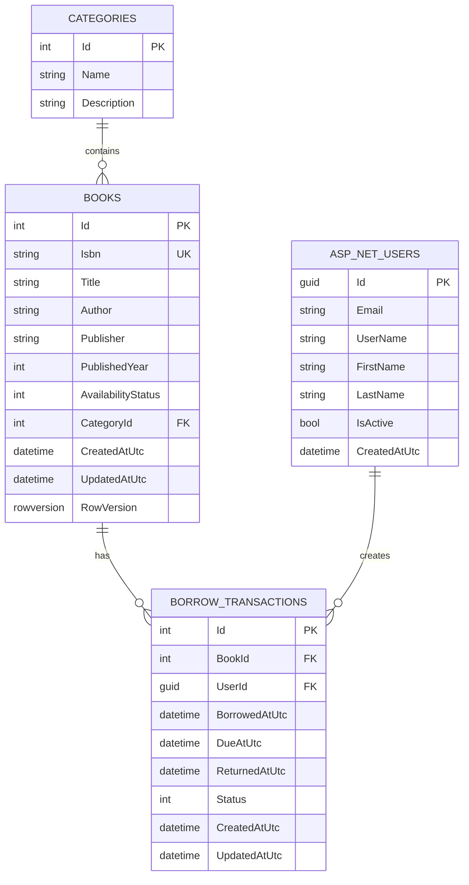

# Library Management System

A library management application built with ASP.NET Core 8, Angular 21, and SQL Server 2022.

## Prerequisites

- Docker Desktop with WSL2 backend and Linux containers enabled
- .NET 8 SDK, if you want to build, test, or run EF commands for the backend from the host
- Node.js 22.12 or newer in the Node 22 release line, if you want to build, test, or run the frontend from the host

## Run Locally

From PowerShell:

```powershell
git clone https://github.com/pun-pannapan/LibraryManagementSystem.git
cd LibraryManagementSystem
Copy-Item .env.example .env
```

Edit `.env` before starting the stack. Replace the example SQL Server passwords, JWT key, and seed user passwords.

### Build and start the full solution with Docker

Build all images and start the database, backend API, and frontend:

```powershell
docker compose up --build -d
docker compose ps
```

Wait until `db`, `api`, and `web` show `healthy`.

| Service | Address |
| --- | --- |
| Frontend | http://localhost:4200 |
| API health | http://localhost:8080/health |
| API through frontend proxy | http://localhost:4200/api/v1/health |
| Swagger | http://localhost:8080/swagger |
| SQL Server | 127.0.0.1,1433 |

Stop the stack:

```powershell
docker compose down
```

This stops containers but keeps the SQL Server volume.

### Build from the host

Use these commands when you want to verify or develop the backend and frontend outside their containers. Run them from the repository root.

Build the .NET solution:

```powershell
dotnet restore backend/LibraryManagement.sln
dotnet build backend/LibraryManagement.sln --configuration Release
```

Install dependencies and build the Angular frontend:

```powershell
npm --prefix frontend ci
npm --prefix frontend run build
```

Build both Docker images without starting them:

```powershell
docker compose build
```

To run the frontend with the Angular development server while the database and API stay in Docker:

```powershell
docker compose up --build -d db api
npm --prefix frontend start
```

Open <http://localhost:4200>. The development server proxies `/api/**` to the API at `http://127.0.0.1:8080`.

## Configuration

Docker Compose reads settings from `.env` in the repository root.

| Setting | Purpose |
| --- | --- |
| `MSSQL_SA_PASSWORD` | SQL Server `sa` password |
| `MSSQL_DATABASE` | Application database name |
| `ASPNETCORE_ENVIRONMENT` | Use `Development` for local migrations, seed data, and Swagger |
| `DB_PORT`, `API_PORT`, `WEB_PORT` | Host ports |
| `CORS_ALLOWED_ORIGINS` | Allowed browser origins |
| `JWT_ISSUER`, `JWT_AUDIENCE`, `JWT_KEY`, `JWT_EXPIRY_MINUTES` | JWT settings |
| `SEED_ADMIN_EMAIL`, `SEED_ADMIN_PASSWORD` | Local admin account |
| `SEED_USER_EMAIL`, `SEED_USER_PASSWORD` | Local user account |

Changing `MSSQL_SA_PASSWORD` after the database volume already exists does not change the password stored inside SQL Server. Update the existing login manually or reset the volume if the data is disposable.

## Demo Accounts

The local development seed creates demo accounts from `.env`.

| Role | Default email |
| --- | --- |
| Administrator | `admin@example.com` |
| User | `user@example.com` |

These accounts are for local development only. Change the passwords before sharing an environment.

## API

Swagger is available in Development:

```text
http://localhost:8080/swagger
```

Main endpoints:

```http
POST /api/v1/auth/register
POST /api/v1/auth/login
GET  /api/v1/auth/me

GET    /api/v1/categories
GET    /api/v1/books
GET    /api/v1/books/{id}
POST   /api/v1/books
PUT    /api/v1/books/{id}
DELETE /api/v1/books/{id}

POST /api/v1/borrowings
POST /api/v1/borrowings/{id}/return
GET  /api/v1/borrowings/me
GET  /api/v1/borrowings

GET /health
GET /api/v1/health
```

Book create, update, delete, and full borrowing history require an administrator token.

## Frontend manual test guide

Run this browser checklist first, after `docker compose up --build -d` has started the database, API, and web containers. Use the email and password values configured in `.env`.

### 1. Check the frontend is reachable

- Open <http://localhost:4200>.
- Confirm the Login page is displayed.
- Open browser DevTools → Network and keep it open while testing.

### 2. Test login validation

- Submit the Login form with both fields empty; required-field messages should appear and no API request should be sent.
- Enter an invalid email; the email validation message should appear before submission.
- Enter a valid email with the wrong password; the page should stay on `/login` and show an incorrect-credentials message.

### 3. Test User

Use the account configured by `SEED_USER_EMAIL` and `SEED_USER_PASSWORD` in `.env`.

- Login successfully and confirm that `/books` opens.
- Open a book detail page.
- Borrow an available book.
- Open `/my-borrowings` and confirm the borrowing appears.
- Return the book.
- Confirm the transaction status changes to `Returned`.
- Confirm that administrator links are not visible.

### 4. Test Administrator

Use the account configured by `SEED_ADMIN_EMAIL` and `SEED_ADMIN_PASSWORD` in `.env`.

- Login successfully and open `/admin/books`.
- Create a book, edit it, and delete it.
- Confirm that required-field, whitespace-only, invalid-year, and missing-category validation prevents invalid submissions.
- Open `/admin/transactions`.
- Test status, date, pagination, and other available filters.

### 5. Check frontend-to-backend requests

In DevTools → Network, confirm that:

- Login calls `POST /api/v1/auth/login` and returns `200`.
- The book list calls `/api/v1/books`.
- Categories call `/api/v1/categories`.
- Authenticated requests include `Authorization: Bearer ...`.
- Unexpected `401` or `403` responses do not occur.

### 6. Check logs when a test fails

```powershell
docker compose logs --tail=100 api
docker compose logs --tail=100 web
docker compose logs --tail=100 db
```

## Backend API Test Guide

You can test the backend from Swagger at:

```text
http://localhost:8080/swagger
```

### 1. Login as Administrator

Call:

```http
POST /api/v1/auth/login
```

Request body:

```json
{
  "email": "admin@example.com",
  "password": "ChangeThisAdminPassword123!"
}
```

Copy the `token` value from the response. In Swagger, click `Authorize` and paste the token only. Do not include the `Bearer` prefix.

### 2. Create a Book

Call:

```http
POST /api/v1/books
```

Request body:

```json
{
  "isbn": "9780321125217",
  "title": "Domain-Driven Design",
  "author": "Eric Evans",
  "publisher": "Addison-Wesley",
  "publishedYear": 2003,
  "categoryId": 1
}
```

Expected result:

```text
201 Created
```

Save the returned `id` and `rowVersion` if you want to test update.

### 3. Update a Book

First get the latest book data:

```http
GET /api/v1/books/{id}
```

Then call:

```http
PUT /api/v1/books/{id}
```

Request body:

```json
{
  "isbn": "9780321125217",
  "title": "Domain-Driven Design Updated",
  "author": "Eric Evans",
  "publisher": "Addison-Wesley",
  "publishedYear": 2003,
  "categoryId": 1,
  "rowVersion": "PASTE_LATEST_ROW_VERSION_HERE"
}
```

Expected result:

```text
200 OK
```

Use the latest `rowVersion` from `GET /api/v1/books/{id}`. If the row version is stale, the API returns `409 Conflict`.

### 4. Login as User

Call:

```http
POST /api/v1/auth/login
```

Request body:

```json
{
  "email": "user@example.com",
  "password": "ChangeThisUserPassword123!"
}
```

Authorize in Swagger with the returned user token.

### 5. Borrow a Book

Find an available book:

```http
GET /api/v1/books
```

Call:

```http
POST /api/v1/borrowings
```

Request body:

```json
{
  "bookId": 1
}
```

Expected result:

```text
201 Created
```

Save the returned borrowing `id`.

### 6. View User Borrowing History

Call:

```http
GET /api/v1/borrowings/me
```

Optional query parameters:

```text
status=Borrowed
page=1
pageSize=20
sort=-borrowedAt
```

### 7. Return a Book

Call:

```http
POST /api/v1/borrowings/{id}/return
```

No request body is required.

Expected result:

```text
200 OK
```

### 8. Check Authorization Rules

With a normal user token, call:

```http
GET /api/v1/borrowings
```

Expected result:

```text
403 Forbidden
```

## Database

In Development, the API applies migrations and seeds the local database during startup.

### ER Diagram



SQL Server data is stored in the Docker volume `sqlserver-data`. To reset all local data:

```powershell
docker compose down -v
docker compose up --build -d
```

Host-side EF commands require the .NET 8 SDK and the local EF tool:

```powershell
dotnet tool restore
```

Set connection values before running EF commands from the host:

```powershell
$env:Database__Server = 'localhost,1433'
$env:Database__Name = 'LibraryManagementDb'
$env:Database__User = 'sa'
$env:Database__Password = '<your local MSSQL_SA_PASSWORD>'
$env:Cors__AllowedOrigins = 'http://localhost:4200'
$env:Jwt__Issuer = 'LibraryManagement'
$env:Jwt__Audience = 'LibraryManagement.Client'
$env:Jwt__Key = 'ChangeThisToAtLeast32Characters123'
```

Apply migrations:

```powershell
dotnet tool run dotnet-ef database update --project backend/src/LibraryManagement.Api --startup-project backend/src/LibraryManagement.Api
```

Add a migration:

```powershell
dotnet tool run dotnet-ef migrations add MigrationName --project backend/src/LibraryManagement.Api --startup-project backend/src/LibraryManagement.Api --output-dir Migrations
```

## Tests

Run backend restore, build, and tests:

```powershell
dotnet restore backend/LibraryManagement.sln
dotnet build backend/LibraryManagement.sln --configuration Release
dotnet test backend/LibraryManagement.sln
```

Run frontend tests and a production build:

```powershell
npm --prefix frontend ci
npm --prefix frontend test -- --watch=false
npm --prefix frontend run build
```

Run all automated checks before opening a pull request:

```powershell
dotnet test backend/LibraryManagement.sln
npm --prefix frontend test -- --watch=false
docker compose build
```

## Frontend

The frontend is a standalone Angular 21 application using Angular Router, Bootstrap 5, Signals, RxJS, Reactive Forms, and Vitest. Its API base URL is `/api/v1`; the Angular development server proxies `/api/**` to the local backend.

Main frontend routes:

- `/login` — sign in
- `/books` and `/books/:id` — browse books and view details
- `/my-borrowings` — view and return personal borrowings
- `/admin/books`, `/admin/books/new`, `/admin/books/:id/edit` — administrator inventory
- `/admin/transactions` — administrator transaction history
- `/forbidden` and `/not-found` — access and route fallback pages

## AI Usage

AI was used as a development assistant for reviewing, testing, and documenting this project. All generated suggestions were checked against the source code, API contracts, build output, and automated tests before being kept.

The following recommended prompts describe the types of assistance used during implementation. Replace the placeholder context with the relevant files, code, logs, or API contract before sending a prompt.

1. **Docker environment review**

   **ภาษาไทย**

   > ช่วยตรวจสอบ Dockerfile และ Docker Compose configuration นี้ว่าใช้สร้าง environment ที่มี database, backend และ frontend ได้ครบตามที่กำหนดหรือไม่ พร้อมบอกจุดที่ควรแก้ไขและวิธีทดสอบ

   **English**

   > Review this Dockerfile and Docker Compose configuration. Verify that it creates the required database, backend, and frontend environment, then identify any issues, recommend specific improvements, and provide verification steps.

2. **Code review**

   **ภาษาไทย**

   > ช่วยรีวิวโค้ดส่วนที่เปลี่ยนแปลงนี้ ตรวจหาจุดที่ควรปรับปรุงด้านความถูกต้อง ความปลอดภัย ความอ่านง่าย การจัดการ error และการดูแลต่อ พร้อมเสนอ patch ที่เหมาะสม

   **English**

   > Review the following code changes for correctness, security, readability, error handling, maintainability, and consistency with the existing project. Explain each finding, prioritize the risks, and propose a focused patch where appropriate.

3. **Backend API unit tests**

   **ภาษาไทย**

   > ช่วยเขียน unit test และ integration test สำหรับ backend API ตามการใช้งานจริง ครอบคลุมกรณีสำเร็จ validation error, authentication, authorization, not found, conflict และกรณีข้อมูลไม่ถูกต้อง

   **English**

   > Write unit and integration tests for this backend API based on its actual behavior and API contract. Cover successful requests, validation errors, authentication, authorization, not-found responses, conflicts, malformed input, and important edge cases.

4. **Authentication token troubleshooting**

   **ภาษาไทย**

   > ช่วยตรวจสอบปัญหา auth token ตั้งแต่การ login, การเก็บ session, การแนบ Bearer token ใน request, token หมดอายุ, การตอบกลับ 401/403 และการ redirect ของ frontend พร้อมแนะนำวิธีแก้และวิธีทดสอบ

   **English**

   > Investigate this authentication-token issue end to end: login, session storage, Bearer-token attachment, token expiry, 401/403 responses, route guards, and frontend redirects. Identify the root cause, recommend the smallest safe fix, and add verification steps or regression tests.

5. **Backend and frontend test cases**

   **ภาษาไทย**

   > ช่วยเขียน test case สำหรับ backend API และ frontend จาก feature ที่มีอยู่ โดยระบุขั้นตอนทดสอบ ข้อมูลที่ใช้ ผลลัพธ์ที่คาดหวัง และกรณีผิดพลาด เพื่อใส่ไว้ใน README

   **English**

   > Create manual test cases for this backend API and frontend feature. For each case, include prerequisites, test data, exact steps, expected results, negative cases, and cleanup notes so the checklist can be added to the README.

6. **Error investigation**

   **ภาษาไทย**

   > Error นี้เกิดจากอะไร ช่วยวิเคราะห์จากข้อความ error, stack trace และโค้ดที่เกี่ยวข้อง พร้อมอธิบายสาเหตุ วิธีแก้ไขที่เหมาะสม และ test ที่ควรเพิ่มเพื่อป้องกันไม่ให้เกิดซ้ำ

   **English**

   > Analyze this error using the error message, stack trace, relevant source code, and runtime context. Explain the root cause, distinguish confirmed facts from assumptions, propose the safest fix, and recommend a regression test to prevent the problem from returning.

## Logs and Health

Check API health:

```powershell
curl.exe http://localhost:8080/health
curl.exe http://localhost:4200/api/v1/health
```

View logs:

```powershell
docker compose logs --tail=100 api
docker compose logs -f db
docker compose logs -f api
docker compose logs -f web
```

`Ctrl+C` stops following logs without stopping the containers.

## Troubleshooting

- Run Docker commands from the repository root.
- If a port is already in use, change `DB_PORT`, `API_PORT`, or `WEB_PORT` in `.env`, then recreate the affected service.
- If SQL Server credentials no longer match the existing volume, reset the local volume with `docker compose down -v`.
- If the API does not become healthy, check `docker compose logs api` and `docker compose logs db`.
