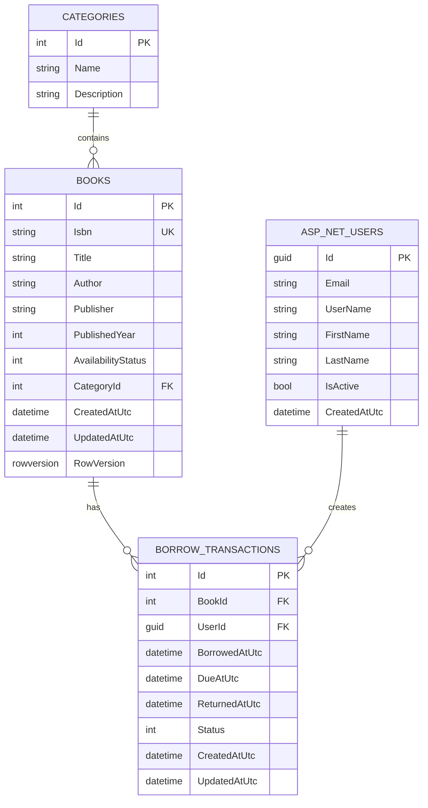

# Library Management System

A library management application built with ASP.NET Core 8, Angular 21, and SQL Server 2022.

## Prerequisites

- Docker Desktop with WSL2 backend and Linux containers enabled
- .NET 8 SDK, only if you want to run backend tests or EF commands from the host
- Node.js 22.12 or newer in the Node 22 release line, only if you want to run frontend tests from the host

## Run Locally

From PowerShell:

```powershell
git clone https://github.com/pun-pannapan/LibraryManagementSystem.git
cd LibraryManagementSystem
Copy-Item .env.example .env
```

Edit `.env` before starting the stack. Replace the example SQL Server passwords, JWT key, and seed user passwords.

Start the application:

```powershell
docker compose up --build -d
docker compose ps
```

Wait until `db`, `api`, and `web` show `healthy`.

| Service | Address |
| --- | --- |
| Frontend | http://localhost:4200 |
| API health | http://localhost:8080/health |
| API through frontend proxy | http://localhost:4200/api/v1/health |
| Swagger | http://localhost:8080/swagger |
| SQL Server | 127.0.0.1,1433 |

Stop the stack:

```powershell
docker compose down
```

This stops containers but keeps the SQL Server volume.

## Configuration

Docker Compose reads settings from `.env` in the repository root.

| Setting | Purpose |
| --- | --- |
| `MSSQL_SA_PASSWORD` | SQL Server `sa` password |
| `MSSQL_DATABASE` | Application database name |
| `ASPNETCORE_ENVIRONMENT` | Use `Development` for local migrations, seed data, and Swagger |
| `DB_PORT`, `API_PORT`, `WEB_PORT` | Host ports |
| `CORS_ALLOWED_ORIGINS` | Allowed browser origins |
| `JWT_ISSUER`, `JWT_AUDIENCE`, `JWT_KEY`, `JWT_EXPIRY_MINUTES` | JWT settings |
| `SEED_ADMIN_EMAIL`, `SEED_ADMIN_PASSWORD` | Local admin account |
| `SEED_USER_EMAIL`, `SEED_USER_PASSWORD` | Local user account |

Changing `MSSQL_SA_PASSWORD` after the database volume already exists does not change the password stored inside SQL Server. Update the existing login manually or reset the volume if the data is disposable.

## Demo Accounts

The local development seed creates demo accounts from `.env`.

| Role | Default email |
| --- | --- |
| Administrator | `admin@example.com` |
| User | `user@example.com` |

These accounts are for local development only. Change the passwords before sharing an environment.

## API

Swagger is available in Development:

```text
http://localhost:8080/swagger
```

Main endpoints:

```http
POST /api/v1/auth/register
POST /api/v1/auth/login
GET  /api/v1/auth/me

GET    /api/v1/categories
GET    /api/v1/books
GET    /api/v1/books/{id}
POST   /api/v1/books
PUT    /api/v1/books/{id}
DELETE /api/v1/books/{id}

POST /api/v1/borrowings
POST /api/v1/borrowings/{id}/return
GET  /api/v1/borrowings/me
GET  /api/v1/borrowings

GET /health
GET /api/v1/health
```

Book create, update, delete, and full borrowing history require an administrator token.

## Backend API Test Guide

You can test the backend from Swagger at:

```text
http://localhost:8080/swagger
```

### 1. Login as Administrator

Call:

```http
POST /api/v1/auth/login
```

Request body:

```json
{
  "email": "admin@example.com",
  "password": "ChangeThisAdminPassword123!"
}
```

Copy the `token` value from the response. In Swagger, click `Authorize` and paste the token only. Do not include the `Bearer` prefix.

### 2. Create a Book

Call:

```http
POST /api/v1/books
```

Request body:

```json
{
  "isbn": "9780321125217",
  "title": "Domain-Driven Design",
  "author": "Eric Evans",
  "publisher": "Addison-Wesley",
  "publishedYear": 2003,
  "categoryId": 1
}
```

Expected result:

```text
201 Created
```

Save the returned `id` and `rowVersion` if you want to test update.

### 3. Update a Book

First get the latest book data:

```http
GET /api/v1/books/{id}
```

Then call:

```http
PUT /api/v1/books/{id}
```

Request body:

```json
{
  "isbn": "9780321125217",
  "title": "Domain-Driven Design Updated",
  "author": "Eric Evans",
  "publisher": "Addison-Wesley",
  "publishedYear": 2003,
  "categoryId": 1,
  "rowVersion": "PASTE_LATEST_ROW_VERSION_HERE"
}
```

Expected result:

```text
200 OK
```

Use the latest `rowVersion` from `GET /api/v1/books/{id}`. If the row version is stale, the API returns `409 Conflict`.

### 4. Login as User

Call:

```http
POST /api/v1/auth/login
```

Request body:

```json
{
  "email": "user@example.com",
  "password": "ChangeThisUserPassword123!"
}
```

Authorize in Swagger with the returned user token.

### 5. Borrow a Book

Find an available book:

```http
GET /api/v1/books
```

Call:

```http
POST /api/v1/borrowings
```

Request body:

```json
{
  "bookId": 1
}
```

Expected result:

```text
201 Created
```

Save the returned borrowing `id`.

### 6. View User Borrowing History

Call:

```http
GET /api/v1/borrowings/me
```

Optional query parameters:

```text
status=Borrowed
page=1
pageSize=20
sort=-borrowedAt
```

### 7. Return a Book

Call:

```http
POST /api/v1/borrowings/{id}/return
```

No request body is required.

Expected result:

```text
200 OK
```

### 8. Check Authorization Rules

With a normal user token, call:

```http
GET /api/v1/borrowings
```

Expected result:

```text
403 Forbidden
```

## Database

In Development, the API applies migrations and seeds the local database during startup.

### ER Diagram



SQL Server data is stored in the Docker volume `sqlserver-data`. To reset all local data:

```powershell
docker compose down -v
docker compose up --build -d
```

Host-side EF commands require the .NET 8 SDK and the local EF tool:

```powershell
dotnet tool restore
```

Set connection values before running EF commands from the host:

```powershell
$env:Database__Server = 'localhost,1433'
$env:Database__Name = 'LibraryManagementDb'
$env:Database__User = 'sa'
$env:Database__Password = '<your local MSSQL_SA_PASSWORD>'
$env:Cors__AllowedOrigins = 'http://localhost:4200'
$env:Jwt__Issuer = 'LibraryManagement'
$env:Jwt__Audience = 'LibraryManagement.Client'
$env:Jwt__Key = 'ChangeThisToAtLeast32Characters123'
```

Apply migrations:

```powershell
dotnet tool run dotnet-ef database update --project backend/src/LibraryManagement.Api --startup-project backend/src/LibraryManagement.Api
```

Add a migration:

```powershell
dotnet tool run dotnet-ef migrations add MigrationName --project backend/src/LibraryManagement.Api --startup-project backend/src/LibraryManagement.Api --output-dir Migrations
```

## Tests

Run backend tests:

```powershell
dotnet test backend/LibraryManagement.sln
```

Run frontend tests:

```powershell
npm --prefix frontend ci
npm --prefix frontend test -- --watch=false
```

## Logs and Health

Check API health:

```powershell
curl.exe http://localhost:8080/health
curl.exe http://localhost:4200/api/v1/health
```

View logs:

```powershell
docker compose logs --tail=100 api
docker compose logs -f db
docker compose logs -f api
docker compose logs -f web
```

`Ctrl+C` stops following logs without stopping the containers.

## Troubleshooting

- Run Docker commands from the repository root.
- If a port is already in use, change `DB_PORT`, `API_PORT`, or `WEB_PORT` in `.env`, then recreate the affected service.
- If SQL Server credentials no longer match the existing volume, reset the local volume with `docker compose down -v`.
- If the API does not become healthy, check `docker compose logs api` and `docker compose logs db`.
